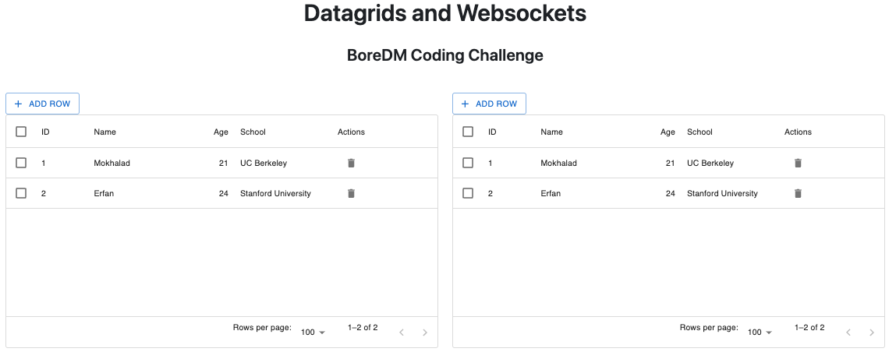

# BoreDM Coding Challenge

## Getting Started

### Installation

1. **Clone the repository**

2. **Install the required packages**

   CD into the server directory and install all the necessary Python packages
   ```
   pip install -r requirements.txt
   ```

### Running the Application

1. **Start the server with this command**

   ```
    hypercorn server:app --reload --bind localhost:8000
   ```

2. **Accessing the Web Interface**
    cd into the client folder and start the development server by running:

    ```
    npm run dev
    ```

Here is a screenshot of what the pagepage looks like:




## Reflections
The development of this challenge took approximately 3 hours, starting at 4AM and ending at around 7 AM. 

### Abstraction
I started off by plainly using `react-use-websocket` for managing WebSocket communications. As the project developed, I recognized the need for a more structured approach to handling WebSocket messages, leading to the creation of a custom hook, `useDataGridWebSocket`. This hook encapsulates all WebSocket logic, including sending and receiving messages, processing CRUD operations, and managing the local state of the data grids.

In the server, each CRUD operation was separated into it's own function, allowing it to be reused for other Databases. Moreover, the server can handle an arbitrary number of connections, not just for 2 datagrids.


### Future Improvements
- **Efficient**: My implementation focused on ensuring functionality and real-time synchronization across clients. However, in doing so, some operations were not optimized for network and processing efficiency. Notably, for edit operations, the entire dataset was sent back to the client after each update. This approach, while simple and effective for maintaining consistency, is not scalable for larger datasets or higher frequencies of updates. 

An efficient approach would be just to send the row and modify that id position in the server's database.
- **Error Handling and Validation**: My solution needs to have more robust error handling and data validation, both on the client and server sides. Enhancing this could improve the application's resilience and user experience, as well as improve security. Interns of error handling with UI, an easy way would be to use [Toast containers](https://fkhadra.github.io/react-toastify/introduction) to display errors.

- **Authentication and Authorization:** Implementing user authentication and authorization would be necessary for a production environment to ensure data security.

- **UI/UX Enhancements:** The UI could benefit from additional refinements and features, such as highlighting cells being edited by other users to enhance the collaborative aspect.


In conclusion, while the project meets the core requirements and demonstrates real-time data synchronization using WebSockets, these reflections highlight opportunities for further development and optimization.